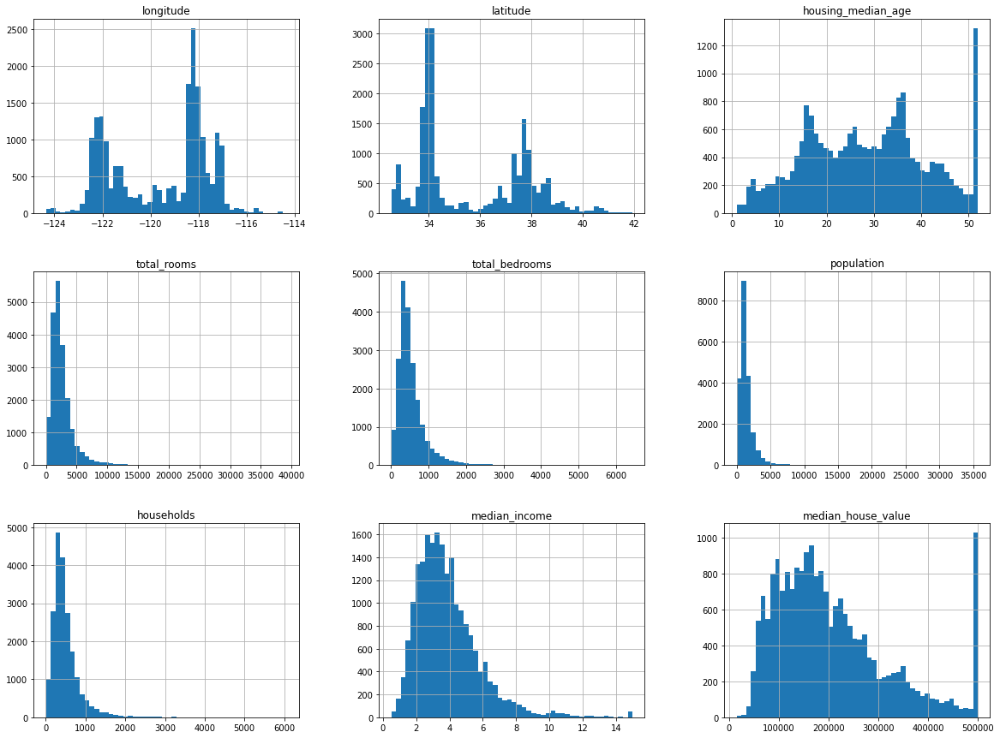

# Linear-Regression-ML


## Table of Contents
- [How to Run](#how-to-run)
- [Libraries](#libraries)
- [Jupyter notebook](#jupyter-notebook)
- [References](#references)

### How to Run 

You can fork/clone this repository and activate the virtual environment that uses python's venv using: ```.\ml_env\Scripts\activate``` on Windows operating systems and ```source ml_env/bin/activate``` on Mac OSx and Linux operating systems.

### Libraries 

The libraries used were `venv, jupyter, sklearn, matplotlib, numpy, scipy, pandas`.

### Jupyter Notebook

We start by fetching the housing data from open source:


```python
import os 
import tarfile 
import urllib

DOWNLOAD_ROOT = "https://raw.githubusercontent.com/ageron/handson-ml2/master/"
HOUSING_PATH = os.path.join("datasets", "housing")
HOUSING_URL = DOWNLOAD_ROOT + "datasets/housing/housing.tgz"

def fetch_housing_data(housing_url = HOUSING_URL, housing_path = HOUSING_PATH):
    os.makedirs(housing_path, exist_ok = True)
    tgz_path = os.path.join(housing_path, "housing.tgz")
    urllib.request.urlretrieve(housing_url, tgz_path)
    housing_tgz = tarfile.open(tgz_path)
    housing_tgz.extractall(path=housing_path)
    housing_tgz.close()

fetch_housing_data()

```


```python
import pandas as pd

def load_housing_data(housing_path = HOUSING_PATH):
    csv_path = os.path.join(housing_path, "housing.csv")
    return pd.read_csv(csv_path)

housing = load_housing_data()
housing.head()
```


<div>
<style scoped>
    .dataframe tbody tr th:only-of-type {
        vertical-align: middle;
    }

    .dataframe tbody tr th {
        vertical-align: top;
    }

    .dataframe thead th {
        text-align: right;
    }
</style>
<table border="1" class="dataframe">
  <thead>
    <tr style="text-align: right;">
      <th></th>
      <th>longitude</th>
      <th>latitude</th>
      <th>housing_median_age</th>
      <th>total_rooms</th>
      <th>total_bedrooms</th>
      <th>population</th>
      <th>households</th>
      <th>median_income</th>
      <th>median_house_value</th>
      <th>ocean_proximity</th>
    </tr>
  </thead>
  <tbody>
    <tr>
      <th>0</th>
      <td>-122.23</td>
      <td>37.88</td>
      <td>41.0</td>
      <td>880.0</td>
      <td>129.0</td>
      <td>322.0</td>
      <td>126.0</td>
      <td>8.3252</td>
      <td>452600.0</td>
      <td>NEAR BAY</td>
    </tr>
    <tr>
      <th>1</th>
      <td>-122.22</td>
      <td>37.86</td>
      <td>21.0</td>
      <td>7099.0</td>
      <td>1106.0</td>
      <td>2401.0</td>
      <td>1138.0</td>
      <td>8.3014</td>
      <td>358500.0</td>
      <td>NEAR BAY</td>
    </tr>
    <tr>
      <th>2</th>
      <td>-122.24</td>
      <td>37.85</td>
      <td>52.0</td>
      <td>1467.0</td>
      <td>190.0</td>
      <td>496.0</td>
      <td>177.0</td>
      <td>7.2574</td>
      <td>352100.0</td>
      <td>NEAR BAY</td>
    </tr>
    <tr>
      <th>3</th>
      <td>-122.25</td>
      <td>37.85</td>
      <td>52.0</td>
      <td>1274.0</td>
      <td>235.0</td>
      <td>558.0</td>
      <td>219.0</td>
      <td>5.6431</td>
      <td>341300.0</td>
      <td>NEAR BAY</td>
    </tr>
    <tr>
      <th>4</th>
      <td>-122.25</td>
      <td>37.85</td>
      <td>52.0</td>
      <td>1627.0</td>
      <td>280.0</td>
      <td>565.0</td>
      <td>259.0</td>
      <td>3.8462</td>
      <td>342200.0</td>
      <td>NEAR BAY</td>
    </tr>
  </tbody>
</table>
</div>


```python
housing.info()
```

    <class 'pandas.core.frame.DataFrame'>
    RangeIndex: 20640 entries, 0 to 20639
    Data columns (total 10 columns):
     #   Column              Non-Null Count  Dtype  
    ---  ------              --------------  -----  
     0   longitude           20640 non-null  float64
     1   latitude            20640 non-null  float64
     2   housing_median_age  20640 non-null  float64
     3   total_rooms         20640 non-null  float64
     4   total_bedrooms      20433 non-null  float64
     5   population          20640 non-null  float64
     6   households          20640 non-null  float64
     7   median_income       20640 non-null  float64
     8   median_house_value  20640 non-null  float64
     9   ocean_proximity     20640 non-null  object 
    dtypes: float64(9), object(1)
    memory usage: 1.6+ MB
    


```python

import matplotlib as plt

housing.hist(bins = 50, figsize = (20,15))

```


    array([[<AxesSubplot:title={'center':'longitude'}>,
            <AxesSubplot:title={'center':'latitude'}>,
            <AxesSubplot:title={'center':'housing_median_age'}>],
           [<AxesSubplot:title={'center':'total_rooms'}>,
            <AxesSubplot:title={'center':'total_bedrooms'}>,
            <AxesSubplot:title={'center':'population'}>],
           [<AxesSubplot:title={'center':'households'}>,
            <AxesSubplot:title={'center':'median_income'}>,
            <AxesSubplot:title={'center':'median_house_value'}>]],
          dtype=object)


    

    


We create a theoretical test set, by randomly picking 20% of our original data set, using a custom built function that assigns an id to a row that we can reuse when selecting our random data:


```python
from zlib import crc32
import numpy as np

def test_set_check(identifier, test_ratio):
    return crc32(np.int64(identifier)) & 0xffffffff < test_ratio* 2**32

def split_train_test_by_id(data, test_ratio, id_column):
    ids = data[id_column]
    in_test_set = ids.apply(lambda id_: test_set_check(id_, test_ratio))
    return data.loc[~in_test_set], data.loc[in_test_set]

housing_with_id = housing.reset_index()
train_set, test_set = split_train_test_by_id(housing_with_id, 0.2, "index")
print(len(train_set))
print(len(test_set))
```

    16512
    4128
    

We can also use sci-kit learn's `train_test_split`:


```python
from sklearn.model_selection import train_test_split

train_set, test_set = train_test_split(housing, test_size = 0.2, random_state = 42)

```

But suppose we don't necessarily want or trust a truly random sample dataset. We want to construct a representative test data set. In the case of housing, median income is an especially important predictor:


```python
housing["income_cat"] = pd.cut(housing["median_income"],
                               bins = [0., 1.5, 3.0, 4.5, 6., np.inf],
                               labels = [1,2,3,4,5])
housing["income_cat"].hist()
```


    <AxesSubplot:>


    

    


We can use sci-kit learn again to sample based on income category:


```python
from sklearn.model_selection import StratifiedShuffleSplit

split = StratifiedShuffleSplit(n_splits = 1, test_size=0.2, random_state = 42)
for train_index, test_index in split.split(housing, housing["income_cat"]):
    strat_train_set = housing.loc[train_index]
    strat_test_set = housing.loc[test_index]

strat_test_set["income_cat"].value_counts()/len(strat_test_set)
```


    3    0.350533
    2    0.318798
    4    0.176357
    5    0.114583
    1    0.039729
    Name: income_cat, dtype: float64


Drop the income category to not pollute the original data set:


```python
for set_ in (strat_train_set, strat_test_set):
    set_.drop("income_cat", axis = 1, inplace = True)

```


```python
housing = strat_train_set.copy()
housing.plot(kind="scatter", x = "longitude", y = "latitude")
```


    <AxesSubplot:xlabel='longitude', ylabel='latitude'>


    

    


```python
housing.plot(kind="scatter", x="longitude", y="latitude", alpha = 0.1)
```


    <AxesSubplot:xlabel='longitude', ylabel='latitude'>


    

    


```python
housing.plot(kind="scatter", x="longitude", y="latitude", alpha = 0.4, 
             s=housing["population"]/100, label = "population", figsize = (10,7),
            c="median_house_value", colorbar=True)


```


    <AxesSubplot:xlabel='longitude', ylabel='latitude'>


    

    


```python
corr_matrix = housing.corr()

corr_matrix["median_house_value"].sort_values(ascending = False)
```


    median_house_value    1.000000
    median_income         0.687160
    total_rooms           0.135097
    housing_median_age    0.114110
    households            0.064506
    total_bedrooms        0.047689
    population           -0.026920
    longitude            -0.047432
    latitude             -0.142724
    Name: median_house_value, dtype: float64


Plotting correlated attrbiutes against each other:


```python
from pandas.plotting import scatter_matrix

attributes = ["median_house_value", "median_income", "total_rooms", "housing_median_age"]
scatter_matrix(housing[attributes], figsize = (12,8))

```


    array([[<AxesSubplot:xlabel='median_house_value', ylabel='median_house_value'>,
            <AxesSubplot:xlabel='median_income', ylabel='median_house_value'>,
            <AxesSubplot:xlabel='total_rooms', ylabel='median_house_value'>,
            <AxesSubplot:xlabel='housing_median_age', ylabel='median_house_value'>],
           [<AxesSubplot:xlabel='median_house_value', ylabel='median_income'>,
            <AxesSubplot:xlabel='median_income', ylabel='median_income'>,
            <AxesSubplot:xlabel='total_rooms', ylabel='median_income'>,
            <AxesSubplot:xlabel='housing_median_age', ylabel='median_income'>],
           [<AxesSubplot:xlabel='median_house_value', ylabel='total_rooms'>,
            <AxesSubplot:xlabel='median_income', ylabel='total_rooms'>,
            <AxesSubplot:xlabel='total_rooms', ylabel='total_rooms'>,
            <AxesSubplot:xlabel='housing_median_age', ylabel='total_rooms'>],
           [<AxesSubplot:xlabel='median_house_value', ylabel='housing_median_age'>,
            <AxesSubplot:xlabel='median_income', ylabel='housing_median_age'>,
            <AxesSubplot:xlabel='total_rooms', ylabel='housing_median_age'>,
            <AxesSubplot:xlabel='housing_median_age', ylabel='housing_median_age'>]],
          dtype=object)


    

    


```python
housing.plot(kind="scatter", x ="median_income", y="median_house_value", alpha = 0.1)
```


    <AxesSubplot:xlabel='median_income', ylabel='median_house_value'>


    

    


```python
housing["rooms_per_household"] = housing["total_rooms"]/housing["households"]
housing["bedrooms_per_room"] = housing["total_bedrooms"]/housing["total_rooms"]
housing["population_per_household"] = housing["population"]/housing["households"]

corr_matrix = housing.corr()
corr_matrix["median_house_value"].sort_values(ascending=False)

```


    median_house_value          1.000000
    median_income               0.687160
    rooms_per_household         0.146285
    total_rooms                 0.135097
    housing_median_age          0.114110
    households                  0.064506
    total_bedrooms              0.047689
    population_per_household   -0.021985
    population                 -0.026920
    longitude                  -0.047432
    latitude                   -0.142724
    bedrooms_per_room          -0.259984
    Name: median_house_value, dtype: float64


```python
housing = strat_train_set.drop("median_house_value", axis = 1)
housing_labels = strat_train_set["median_house_value"].copy()


```

Now we want to replace missing features with median features:


```python
from sklearn.impute import SimpleImputer

imputer = SimpleImputer(strategy = "median")

housing_num = housing.drop("ocean_proximity", axis = 1)

imputer.fit(housing_num)

imputer.statistics_
```


    array([-118.51  ,   34.26  ,   29.    , 2119.5   ,  433.    , 1164.    ,
            408.    ,    3.5409])


```python
housing_num.median().values
```


    array([-118.51  ,   34.26  ,   29.    , 2119.5   ,  433.    , 1164.    ,
            408.    ,    3.5409])


```python
X = imputer.transform(housing_num)

housing_tr = pd.DataFrame(X, columns = housing_num.columns, index = housing_num.index)

```


```python
housing_cat = housing[["ocean_proximity"]]
housing_cat.head(10)
```


<div>
<style scoped>
    .dataframe tbody tr th:only-of-type {
        vertical-align: middle;
    }

    .dataframe tbody tr th {
        vertical-align: top;
    }

    .dataframe thead th {
        text-align: right;
    }
</style>
<table border="1" class="dataframe">
  <thead>
    <tr style="text-align: right;">
      <th></th>
      <th>ocean_proximity</th>
    </tr>
  </thead>
  <tbody>
    <tr>
      <th>17606</th>
      <td>&lt;1H OCEAN</td>
    </tr>
    <tr>
      <th>18632</th>
      <td>&lt;1H OCEAN</td>
    </tr>
    <tr>
      <th>14650</th>
      <td>NEAR OCEAN</td>
    </tr>
    <tr>
      <th>3230</th>
      <td>INLAND</td>
    </tr>
    <tr>
      <th>3555</th>
      <td>&lt;1H OCEAN</td>
    </tr>
    <tr>
      <th>19480</th>
      <td>INLAND</td>
    </tr>
    <tr>
      <th>8879</th>
      <td>&lt;1H OCEAN</td>
    </tr>
    <tr>
      <th>13685</th>
      <td>INLAND</td>
    </tr>
    <tr>
      <th>4937</th>
      <td>&lt;1H OCEAN</td>
    </tr>
    <tr>
      <th>4861</th>
      <td>&lt;1H OCEAN</td>
    </tr>
  </tbody>
</table>
</div>


We can convert string-represented categories with encodings, but this might raise an issue because ML algorithms will interpret similar numerical values as actual similarity when the numerical values may not represent such a similarity.


```python
from sklearn.preprocessing import OrdinalEncoder
ordinal_encoder = OrdinalEncoder()
housing_cat_encoded = ordinal_encoder.fit_transform(housing_cat)
housing_cat_encoded[:10]
```


    array([[0.],
           [0.],
           [4.],
           [1.],
           [0.],
           [1.],
           [0.],
           [1.],
           [0.],
           [0.]])


```python
ordinal_encoder.categories_

```


    [array(['<1H OCEAN', 'INLAND', 'ISLAND', 'NEAR BAY', 'NEAR OCEAN'],
           dtype=object)]


Alternatively we can use One-hot encoding to assign binary values for each category where it is 1 if it is in that category else 0. This works well for small data-sets where there are not many categories.


```python
from sklearn.preprocessing import OneHotEncoder
cat_encoder = OneHotEncoder()
housing_cat_1hot = cat_encoder.fit_transform(housing_cat)
housing_cat_1hot
```


    <16512x5 sparse matrix of type '<class 'numpy.float64'>'
    	with 16512 stored elements in Compressed Sparse Row format>


# Custom Transformers

Custom transformers that can be integrated with scikit learn need to be a class thhat has three methods:
- fit()
- transform()
- fit_transform()


```python
from sklearn.base import BaseEstimator, TransformerMixin

rooms_ix, bedrooms_ix, population_ix, households_ix = 3,4,5,6

class CombinedAttributesAdder(BaseEstimator, TransformerMixin):
    def __init__(self, add_bedrooms_per_room = True):
        self.add_bedrooms_per_room = add_bedrooms_per_room
    
    def fit(self, X, y=None):
        return self
    def transform(self, X):
        rooms_per_household = X[:, rooms_ix]/ X[:, households_ix]
        population_per_household = X[:, population_ix] / X[:, households_ix]
        if self.add_bedrooms_per_room:
            bedrooms_per_room = X[:, bedrooms_ix]/ X[:, rooms_ix]
            return np.c_[X, rooms_per_household, population_per_household, bedrooms_per_room]
        else:
            return np.c_[X, rooms_per_household, population_per_household]

attr_adder = CombinedAttributesAdder(add_bedrooms_per_room = False)
housing_extra_attribs = attr_adder.transform(housing.values)
```

# Feature Scaling
With data-sets that have features that scale very differenTly, for example, 0-15 versus 6-36000+, it is good practice to scale the values. There are two main ways to do so:
- **min-max scaling**: shifting and rescaling values to be in the range \[0,1\] **SciKit**: **MinMaxScaler**
- **standardization**: subtracting the mean value ( => standardized mean values are always 0), then divides it by the standard deviation so the resulting distribution has unit variance. It does not have a specific bound for values, but is less affected by statistical outliers our data input mistakes. **SciKit**: **StandardScaler**.


N.B.: It is important to fit the the scalers to the training data only, not the full data set.

# Transformation Pipelines 

Sci-kit pipeline class helps order transformations:


```python
from sklearn.pipeline import Pipeline
from sklearn.preprocessing import StandardScaler

num_pipeline = Pipeline([
    ("imputer", SimpleImputer(strategy="median")),
    ("attribs_adder", CombinedAttributesAdder()),
    ("std_scalar", StandardScaler()),
])

housing_num_tr = num_pipeline.fit_transform(housing_num)

```


```python
from sklearn.compose import ColumnTransformer

num_attribs = list(housing_num)
cat_attribs = ["ocean_proximity"]

full_pipeline = ColumnTransformer([
    ("num", num_pipeline, num_attribs),
    ("cat", OneHotEncoder(), cat_attribs)
])

housing_prepared = full_pipeline.fit_transform(housing)
```

# Select and Train a Model

We visualy analyzed the data, created a representative training and test set, and created some pipelines to clean up the data in said training data set.

We start with a Linear Regression Model:


```python
from sklearn.linear_model import LinearRegression

lin_reg = LinearRegression()
lin_reg.fit(housing_prepared, housing_labels)


```


    LinearRegression()


```python
some_data = housing.iloc[:5]
some_labels = housing_labels.iloc[:5]
some_data_prepared = full_pipeline.transform(some_data)
print("Predictions:", lin_reg.predict(some_data_prepared))
print("Labels:", list(some_labels))
```

    Predictions: [210644.60459286 317768.80697211 210956.43331178  59218.98886849
     189747.55849879]
    Labels: [286600.0, 340600.0, 196900.0, 46300.0, 254500.0]
    

The values appear to be quite off, let's calculate the RMSE of this fit:


```python
from sklearn.metrics import mean_squared_error
housing_predictions = lin_reg.predict(housing_prepared)
lin_mse = mean_squared_error(housing_labels, housing_predictions)
lin_rmse = np.sqrt(lin_mse)
lin_rmse
```


    68628.19819848923


```python
from sklearn.tree import DecisionTreeRegressor

tree_reg = DecisionTreeRegressor()
tree_reg.fit(housing_prepared, housing_labels)

```


    DecisionTreeRegressor()


```python
housing_predictions = tree_reg.predict(housing_prepared)
tree_mse = mean_squared_error(housing_labels, housing_predictions)
tree_rmse = np.sqrt(tree_mse)
tree_rmse
```


    0.0


An error of 0.0 is a strong indicator of overfitting the data, so let's try to cross-validate the decision tree by paritioning the original training set into smaller training sets, which can be used as mini-training/mini-testing pairs on the data.


```python
from sklearn.model_selection import cross_val_score

scores = cross_val_score(tree_reg, housing_prepared, housing_labels,
                         scoring = "neg_mean_squared_error", cv= 10)
tree_rmse_scores = np.sqrt(-scores)
```


```python
def display_scores(scores):
    print("Scores: ", scores )
    print("Mean: ", scores.mean())
    print("Standard Deviation: ", scores.std())
    
display_scores(tree_rmse_scores)
```

    Scores:  [68752.02958684 67846.4958889  71460.92081716 69511.26432802
     70840.78570113 75781.65138672 71275.81526088 71252.33032444
     76030.34096403 69961.71875403]
    Mean:  71271.3353012159
    Standard Deviation:  2571.0339279945174
    

The outcome of the overfitting is just as bad, if not worse, as the linear regression model. Let's try a Random Forest Regressor, which work by training many decision trees on random subsets of the features then averaging out their predictions.


```python
from sklearn.ensemble import RandomForestRegressor

forest_reg = RandomForestRegressor()
forest_reg.fit(housing_prepared, housing_labels)

```


    RandomForestRegressor()


```python
forest_score = cross_val_score(forest_reg, housing_prepared, housing_labels, 
                               scoring = "neg_mean_squared_error", cv = 10)
forest_rmse = np.sqrt(-forest_score)
display_scores(forest_rmse)
```

# Grid Search

Grid Search allows us to search for the best hyperparameters combinations to optimize in our model.


```python
from sklearn.model_selection import GridSearchCV

param_grid = [
    {"n_estimators": [3,10,30], "max_features": [2,4,6,8]},
    {"bootstrap": [False], "n_estimators": [3,10], "max_features": [2,3,4]},
]

forest_reg = RandomForestRegressor()

grid_search = GridSearchCV(forest_reg, param_grid, cv = 5,
                          scoring = 'neg_mean_squared_error',
                          return_train_score = True)

grid_search.fit(housing_prepared, housing_labels)

grid_search.best_params_
```


    {'max_features': 6, 'n_estimators': 30}


```python
grid_search.best_estimator_
```


    RandomForestRegressor(max_features=6, n_estimators=30)


```python
cvres = grid_search.cv_results_
for mean_score, params in zip(cvres["mean_test_score"], cvres["params"]):
    print(np.sqrt(-mean_score), params)
```

    64344.05776243392 {'max_features': 2, 'n_estimators': 3}
    56079.46630427452 {'max_features': 2, 'n_estimators': 10}
    53173.118497102296 {'max_features': 2, 'n_estimators': 30}
    60186.317535572874 {'max_features': 4, 'n_estimators': 3}
    53212.39942697105 {'max_features': 4, 'n_estimators': 10}
    50583.062001177335 {'max_features': 4, 'n_estimators': 30}
    58694.7167288283 {'max_features': 6, 'n_estimators': 3}
    52246.81155490872 {'max_features': 6, 'n_estimators': 10}
    50380.134793068006 {'max_features': 6, 'n_estimators': 30}
    58106.47037650012 {'max_features': 8, 'n_estimators': 3}
    52300.35181290864 {'max_features': 8, 'n_estimators': 10}
    50405.48915691922 {'max_features': 8, 'n_estimators': 30}
    61975.095748030195 {'bootstrap': False, 'max_features': 2, 'n_estimators': 3}
    54884.535662734736 {'bootstrap': False, 'max_features': 2, 'n_estimators': 10}
    60889.93631607643 {'bootstrap': False, 'max_features': 3, 'n_estimators': 3}
    52622.73805854512 {'bootstrap': False, 'max_features': 3, 'n_estimators': 10}
    59167.59544490101 {'bootstrap': False, 'max_features': 4, 'n_estimators': 3}
    51642.829266553614 {'bootstrap': False, 'max_features': 4, 'n_estimators': 10}
    

# Randomized Search

A Randomized search on hyperparameters might be better when the hyperparameter search space is large and we don't have any inclination on which combinations might be best.

It also allows us to control the number of iterations we want to run the search.

## Analyze the best models and their errors

You can sometimes gain good insight by looking where the best models succeed and fail.


```python
feature_importances = grid_search.best_estimator_.feature_importances_
feature_importances
```


    array([7.99631582e-02, 7.25905608e-02, 4.18344633e-02, 1.80813917e-02,
           1.70741261e-02, 1.97236834e-02, 1.60127362e-02, 3.31817365e-01,
           6.47855625e-02, 1.04073055e-01, 6.10905439e-02, 1.03638906e-02,
           1.56366658e-01, 1.56481737e-05, 3.24900615e-03, 2.95815060e-03])


```python
extra_attribs = ["rooms_per__hhold", "pop_per_hhold", "bedrooms_per_room"]
cat_encoder = full_pipeline.named_transformers_["cat"]
cat_one_hot_attribs = list(cat_encoder.categories_[0])
attributes = num_attribs + extra_attribs + cat_one_hot_attribs
sorted(zip(feature_importances, attributes), reverse = True)
```


    [(0.3318173651817202, 'median_income'),
     (0.15636665802677777, 'INLAND'),
     (0.10407305512594535, 'pop_per_hhold'),
     (0.07996315821708103, 'longitude'),
     (0.0725905607529039, 'latitude'),
     (0.0647855625062422, 'rooms_per__hhold'),
     (0.06109054393422902, 'bedrooms_per_room'),
     (0.04183446328258569, 'housing_median_age'),
     (0.019723683424038425, 'population'),
     (0.018081391656819636, 'total_rooms'),
     (0.017074126138778272, 'total_bedrooms'),
     (0.01601273624552966, 'households'),
     (0.010363890583921913, '<1H OCEAN'),
     (0.003249006152081443, 'NEAR BAY'),
     (0.0029581505976024073, 'NEAR OCEAN'),
     (1.564817374307557e-05, 'ISLAND')]


From this we can see that near ocean is one of the most important attributes and that we should consider dropping some others.

## Evaluate your system on the Test set


```python
final_model = grid_search.best_estimator_

X_test = strat_test_set.drop("median_house_value", axis = 1)
y_test = strat_test_set["median_house_value"].copy()

X_test_prepared = full_pipeline.transform(X_test)

final_predictions = final_model.predict(X_test_prepared)

final_mse = mean_squared_error(y_test, final_predictions)
final_rmse = np.sqrt(final_mse)
```


```python
from scipy import stats

confidence = 0.95
squared_errors = (final_predictions - y_test) **2
np.sqrt(stats.t.interval(confidence, len(squared_errors) -1, loc = squared_errors.mean(), scale = stats.sem(squared_errors) ))
```


    array([45641.67651073, 49454.49970754])


```python

```
### References
- Géron, Aurélien. Hands-on machine learning with Scikit-Learn, Keras, and TensorFlow: Concepts, tools, and techniques to build intelligent systems. O'Reilly Media, 2019.
